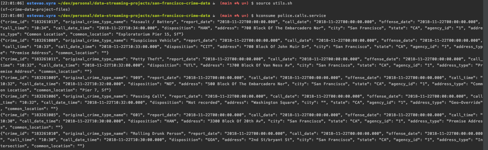
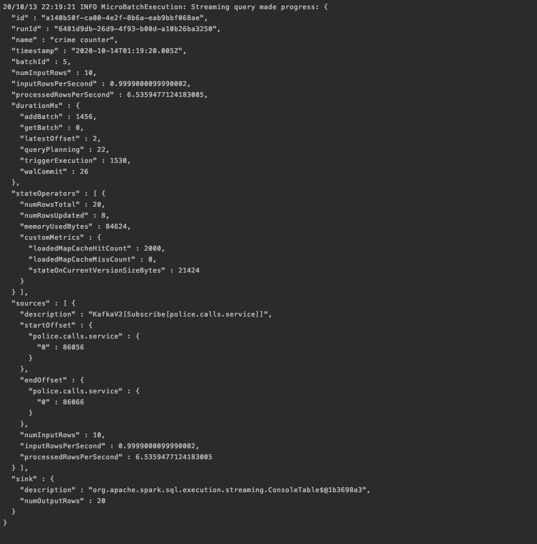
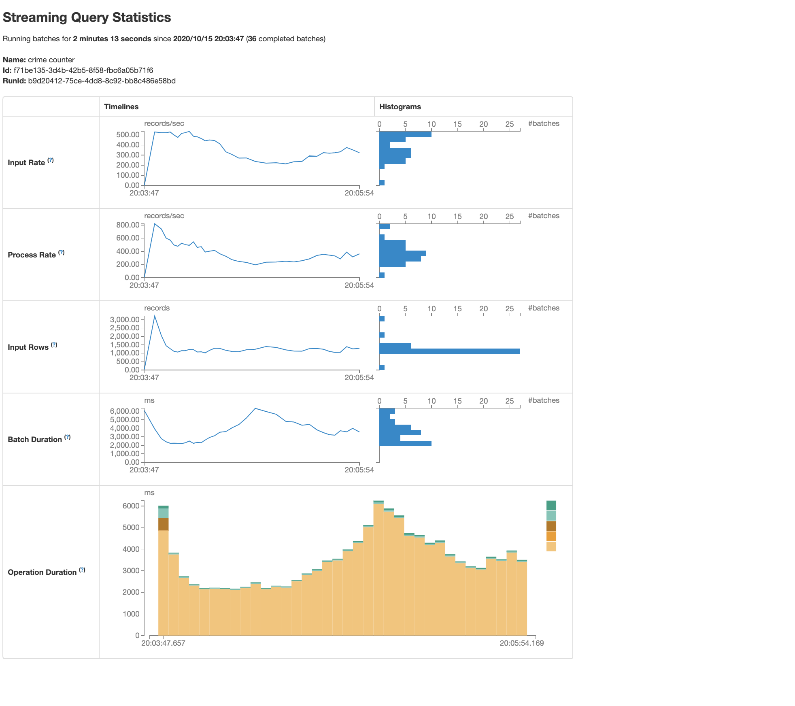

# San Francisco Crime Data

This project was developed with a focus on Spark Streaming.


## Running the project

First we need kafka working. We need to instantiate the kafka zookeeper and the kafka server. 
There are some helper functions for that in `utils.sh`, but you must change the `kafka_home` variable. 

Then start the kafka producer with 
```shell script
python kafka_server.py
```

Run the spark script locally with

```shell script
spark-submit --packages org.apache.spark:spark-sql-kafka-0-10_2.12:3.0.1 --master local[*] data_stream.py
```

It is possible to inspect the kafka topic directly using the console consumer, 


While spark streaming works on the queries, it sends progress reports for each minibatch, such as this one


While the query runs, opening your_username:4040 shows you spark's user interface, 
where statistics about each query are depicted in charts


## Parameter keys
> How did changing values on the SparkSession property parameters affect 
the throughput and latency of the data?

Two parameters were tested: 
 - spark.driver.memory
 - spark.executor.memory

Spark did not accept values smaller than 500mb for any of them, 
what I believe made the experiment less fruitful than it could have been. 
Since the experiments are local, the amount of parallelization is limited.
In the end, for any combination of parameters, the throughput was similar. 

Interestingly, there is a clear difference between the aggregation and the join, when seen in the UI. 
Joining has much more variation in the latencies and processing rates for each batch.

> What were the 2-3 most efficient SparkSession property key/value pairs? 
Through testing multiple variations on values, how can you tell these were the most optimal?

Given that running locally this does not seem to impact too much our results, 
it is hard to say any of them was optimal. 
In either driver or executor, 500mb seems to suffice for the necessary computations.

Another parameter that could be changed is `spark.default.parallelism`, 
which defines the number of partitions for shuffle operations.
Since the default value for the local case is the number of cores in the machine, 
it was probably already in the optimal value, and reducing it could hinder performance.   


### Number of partitions
Because we let the kafka auto-create the topic, it was originally created with a single partition. 
A simple way of confirming this is by running `ls /tmp/kafka-logs/` since the kafka is local,
and seeing that there is only one folder for our created topic, "_police.calls.service-0_".

To look for performance improvements, we added new topics via 

```shell script
"${kafka_home}"/bin/kafka-topics.sh --zookeeper localhost:2181 --alter --topic police.calls.service --partitions 10
```

But in our case this didn't change the performance significantly.